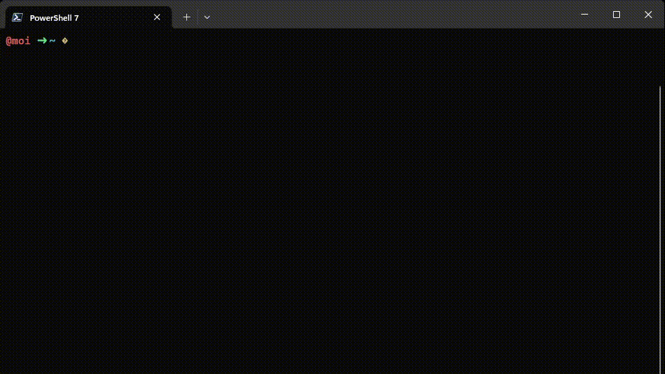

# PowerShell Profile: Oh My Posh & Linux-Style Key Bindings

## Why does this exist?

If you’re like me and genuinely *enjoy* using Windows, because what’s life as a web developer without a few extra challenges, then this setup is for you!  
Sometimes we pick Windows for the fun of it, the thrill of a fresh update, or just because we love a good plot twist in our workflow.

But why settle for the default terminal vibes when you can make your PowerShell look and feel (almost) as cool as a Linux shell? With this repo, you get a terminal that’s actually fun to use. Let’s embrace Windows and make the best of it, one prompt at a time.

## Features

- ✨ **Oh My Posh** for a customizable, eye-catching prompt (if you’re staring at a terminal, it should spark joy)
- ⌨️ **Linux-style key bindings** so your muscle memory survives the jump between platforms
- 🛠️ Modular config so you can add hacks and tweaks as you wish
- 🖥️ Productivity boosts that’ll have you wondering, “Is this really PowerShell?!”

## Preview



## Installation

1. **Clone this repository (downloading zip files is so last decade):**
   ```sh
   git clone https://github.com/YOUR-USERNAME/YOUR-REPO-NAME.git
   ```
   
2. **Copy the profile to your PowerShell profile location:**
   (Or symlink it if you like to live dangerously.)
   ```powershell
    # Example: Copying from repo's src/ folder
    cp ./src/Microsoft.PowerShell_profile.ps1 $PROFILE
    ```
   
3. **Install the prerequisites:**
    - [PowerShell](https://learn.microsoft.com/en-us/powershell/scripting/install/installing-powershell-on-windows?view=powershell-7.5) (of course, manually installing the latest version)
      - `winget install --id Microsoft.PowerShell --source winget`
    - [Oh My Posh](https://ohmyposh.dev/docs/installation/windows/) (your prompt deserves a glow up)
      - `winget install JanDeDobbeleer.OhMyPosh -s winget`

4. **Pick a theme:**
   Use your favorite `.omp.json` or grab mine (`zash.omp.json`). Toss it in your themes folder and point your profile to it. (Make it yours!)

## Linux-Style Key Bindings (For Your Fingers’ Happiness)

| Shortcut           | Action                                    |
|--------------------|-------------------------------------------|
| `Ctrl+a`           | Move to beginning of line                 |
| `Ctrl+e`           | Move to end of line                       |
| `Ctrl+b` / `Ctrl+f`| Move backward/forward one character       |
| `Alt+b` / `Alt+f`  | Move backward/forward one word            |
| `Ctrl+d`           | Delete character under cursor             |
| `Ctrl+k`           | Delete to end of line                     |
| `Ctrl+u`           | Delete to beginning of line               |
| `Ctrl+w` / `Alt+d` | Delete word before/after cursor           |
| `Ctrl+y`           | Yank (paste)                              |
| `Ctrl+z`           | Undo                                      |
| `Ctrl+Shift+z`     | Redo                                      |
| `Ctrl+r`           | Reverse history search                    |
| `Ctrl+l`           | Clear screen                              |
| `Ctrl+n` / `Ctrl+p`| Next/previous command in history          |

## Customization

- Hack the `.ps1` in `src/` to your heart’s content (add aliases, load your favorite modules, get creative)
- Swap in your favorite Oh My Posh theme (or build your own and brag about it in your README)

## Contributing

PRs, memes, and clever key bindings are all welcome! If you’ve found a way to make Windows development even a little bit smoother, or you’ve got a tweak that saves some keystrokes, open a PR.  

Let’s make PowerShell surprisingly awesome!
